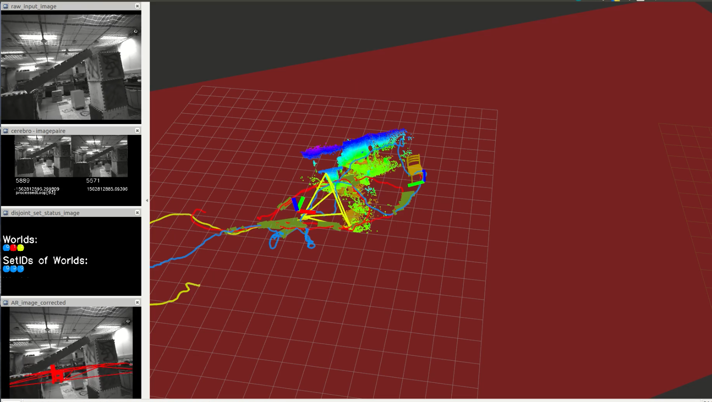

# Simple AR Demo to test Visual-Inertial SLAM (VINS)

## v3
With this version it is possible to load trigulated mesh objects (in .obj).
Our DIY renderer can do wireframe rendering of mesh objects. If running
surfel_fusion node, branch VINS_kidnapping (https://github.com/HKUST-Aerial-Robotics/DenseSurfelMapping),
this node can estimate the ground plane and compute the ground orientation
with respect to the camera (see screenshot).

This version
can subscribe to path messages from kidnap aware pose graph solver(https://github.com/mpkuse/solve_keyframe_pose_graph). This allows us
to do correct rendering even under kidnaps. 

## v2
Implemented a new node with interactive markers. You need to run two nodes.  
a) interactive_marker_server 
b) ar_demo_node2.cpp (essentially similar to ar_demo.cpp with more bells and whistles) 

## v1
This is a simple ros node. Subscribes to :
- raw input images (sensor_msg::Image)
- path (nav_msg::Path)

It produces an ar-image and a MarkerArray. The ar-image is the rendering of a
cube at world position (-2, 0, -1.2) using the path from a SLAM system. This is
mainly used to test the accuracy for your SLAM system.

This is a very simple node essentially just 1 file, viz., src/ar_demo_node.cpp.
Just read and edit the code as needed.

Originally borrowed from [VINS-Mono](https://github.com/HKUST-Aerial-Robotics/VINS-Mono/tree/master/ar_demo)

Contributors:
- [Qin Tong](https://github.com/qintonguav/)
- [Manohar Kuse](https://github.com/mpkuse/)
